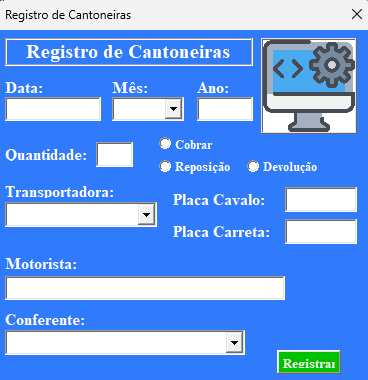
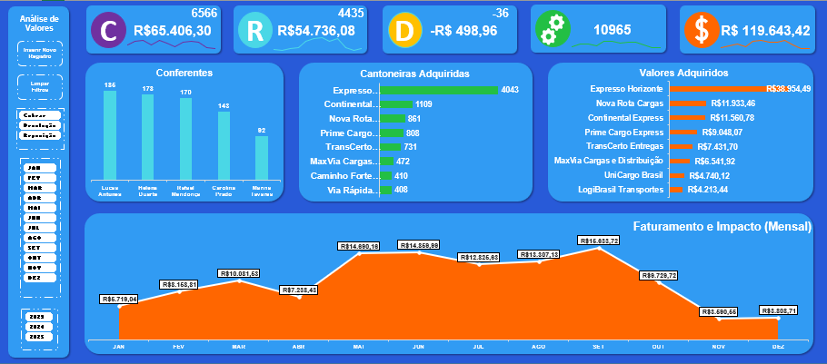

# 📊 Dashboard Automática com Tela de Preenchimento (Excel VBA)

Este projeto foi desenvolvido durante o meu período como Jovem Aprendiz de Logística.
Na rotina diária, era necessário preencher manualmente diversas células no Excel com informações como data, ano, transportadora, placa do veículo, entre outros dados operacionais.
Além disso, era preciso gerar relatórios periódicos para acompanhamento e apresentação dos resultados.

Com o objetivo de otimizar esse processo e reduzir erros manuais, criei uma planilha automatizada em VBA que:
- Permite o preenchimento rápido dos dados por meio de uma tela interativa (UserForm);
- Armazena as informações em uma base estruturada;
- Atualiza automaticamente uma dashboard com gráficos e indicadores de desempenho logístico.

Essa solução simplificou significativamente a geração de relatórios e aumentou a eficiência das atividades diárias no setor de logística.

***OBS.: Todos os dados reias da planilha foram substituídos por fictícios.***

---

## 🧩 Funcionalidades

- 📝 **Formulário de Entrada**: o usuário preenche dados em uma interface amigável.
- ⚙️ **Atualização Automática**: ao confirmar o preenchimento, o VBA:
  - Insere os dados em uma base estruturada;
  - Atualiza gráficos e indicadores automaticamente;
- 📈 **Dashboard Dinâmica**: construída com Tabelas Dinâmicas e Gráficos Dinâmicos, vinculada à base de dados.

---

## 🧰 Tecnologias Utilizadas

- **Excel 365**
- **VBA (Visual Basic for Applications)**
- **UserForms**
- **Tabelas e Gráficos Dinâmicos**
- **Macros Automatizadas**

---

## ▶️ Como Usar

1. **Baixe o arquivo:** [`Controle Cantoneiras 2021.xlsm`](./Controle%20Cantoneiras%202021.xlsm)  
2. **Habilite macros** ao abrir o Excel.  
3. Preencha os dados **(Abertura automática do formulário)** e clique em **Registrar**.  
4. Veja a dashboard se atualizar automaticamente. 🎯  

---

## 🖼️ Capturas de Tela

  

  

